# Claude Code status light for the Ulanzi TC001

Turn a **Ulanzi TC001** pixel clock (running **AWTRIX 3**) into an ambient status
display for your Claude Code sessions. Glance at the desk clock instead of the
terminal: it tells you when Claude is working, and — more usefully — when it has
stopped and is waiting on you.

| | |
|---|---|
| 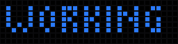 | **WORKING** — at least one session is mid-turn |
| 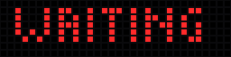 | **WAITING** — a session needs your input or a permission decision |
| _(clock face)_ | everything is idle; the normal app rotation resumes |

Both states carry a bar along the bottom row: a fuel gauge for your current
5-hour Claude Code budget that grows from the left as you spend it, turning
amber at 75% and red at 90%. So a glance tells you not just that Claude is busy
but how close you are to running out. (It appears once the `usage` screen's data
is available — see below — and is simply omitted otherwise.)

It is **multi-session aware**: every session's state is tracked separately and
the clock shows the single most urgent one — `red > blue > green` — so a red
WAITING in one terminal is never hidden by another terminal that is busy.

When nothing needs your attention, the clock goes back to its normal rotation of
effect screens, plus two extras this project adds: a **countdown** to a date you
pick, and a live **Claude Code usage** readout.

> Every animation in this README was captured from the real panel by
> [`tools/capture-screens.py`](tools/capture-screens.py), which polls AWTRIX's
> `/api/screen` framebuffer — these are recordings of the hardware, not mockups.

---

## The screens

| | | | |
|---|---|---|---|
| 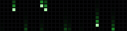<br>`matrix` | 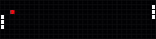<br>`pong` | 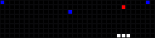<br>`brick` | 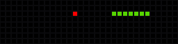<br>`snake` |
| 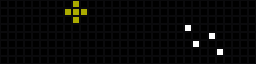<br>`fireworks` | <br>`ripple` | 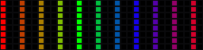<br>`chase` | 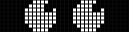<br>`eyes` |
| 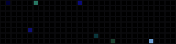<br>`stars` | 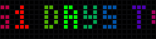<br>`countdown` | 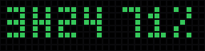<br>`usage` | |

`matrix` … `stars` are stock AWTRIX effects. The last two are computed on your
Mac and pushed as text:

- **`countdown`** — days remaining until a target date, scrolling in rainbow.
  Rolls through `N DAYS TO GO` → `1 DAY LEFT!` → `IT'S HERE!` (over a fireworks
  background on the day itself).
- **`usage`** — your Claude Code limits at a glance, e.g. `2H15 85%`: time until
  the current 5-hour window resets, and how much of that window's budget is still
  unspent. Shaded green / amber / red by what's left, and goes grey rather than
  lying if the data goes stale. It sits still rather than scrolling.

Which screens are enabled, how long each stays up, and how fast it animates are
all controlled from the bundled web panel (below) — no redeploy needed.

---

## What's in the box

| File | Role |
|---|---|
| `status-light.sh` | Hook-driven. Records per-session state, aggregates it, pushes the colour to the clock. |
| `claude-ticker.sh` | launchd watchdog, every 15s. Re-evaluates the light, re-pushes screens, enforces quiet hours. |
| `claude-usage.sh` | Fetches your rate-limit numbers into a small cache for the `usage` screen. |
| `display-power.sh` | The single source of truth for matrix power (quiet hours, Mac sleep). |
| `control.html` | Self-contained settings panel you upload to the device. Brightness, screens, live stats. |
| `restore-device.sh` | Reapplies the saved config after a factory reset or reflash. |
| `screens.json`, `device-settings.json` | Known-good defaults, checked in for disaster recovery. |
| `settings-hooks.json`, `com.local.claude-ticker.plist` | The wiring you merge into Claude Code / launchd. |
| `sleep-hook.sh`, `wakeup-hook.sh` | Optional: make the display follow your Mac's sleep state. |

There is **no build step**. These are standalone bash scripts you copy into
`~/.claude/`.

---

## Getting started (brand-new device)

**You need:** a Ulanzi TC001 (or TC001 Smart Pixel Clock), a USB-C cable, a Mac
running Claude Code, and a 2.4 GHz WiFi network (the ESP32 in the TC001 cannot
join 5 GHz).

### 1. Flash AWTRIX 3

The TC001 ships with Ulanzi's own firmware; this project needs **AWTRIX 3**
(the open-source replacement by Blueforcer). Flashing is done from a browser
over USB — no toolchain, no soldering.

- **Web flasher: <https://blueforcer.github.io/awtrix3/#/flasher>** — plug the
  clock into USB, open that page in **Chrome or Edge** (Web Serial is not
  supported in Safari or Firefox), pick the serial port, and let it write.
- Full walkthrough: <https://blueforcer.github.io/awtrix3/#/quickstart>
- Already on AWTRIX and just updating: <https://blueforcer.github.io/awtrix3/#/upgrade>
- Hardware notes / other supported boards: <https://blueforcer.github.io/awtrix3/#/hardware>
- Project home and releases: <https://github.com/Blueforcer/awtrix3>
- Reverting to the stock Ulanzi firmware, if you ever want to:
  <https://blueforcer.github.io/awtrix3/#/original>

This project was built and tested against AWTRIX **0.98**. A couple of the
workarounds below are specific to that version's quirks.

### 2. Get it on your network and find its IP

After flashing, the clock starts its own WiFi access point (`AWTRIX_xxxx`).
Join it from your phone or Mac, and the captive portal will ask for your
network's SSID and password. Once it reconnects, the device shows its IP address
on the matrix at boot; you can also find it in your router's client list.

Confirm it from your Mac:

```bash
curl -s "http://<device-ip>/api/stats"
# {"bat":97,...,"version":"0.98","uid":"awtrix_xxxxxx","ip_address":"..."}
```

**Give the clock a DHCP reservation** in your router while you're there — every
script addresses it by IP, so a lease change would otherwise silently break it.

> The AWTRIX HTTP API has **no authentication**. Anyone on your LAN can drive the
> display. Keep it on a network you trust; don't port-forward it.

### 3. Install the scripts

```bash
git clone https://github.com/pp84/ulanzi-claude-status.git
cd ulanzi-claude-status
cp status-light.sh claude-ticker.sh claude-usage.sh display-power.sh ~/.claude/
chmod +x ~/.claude/{status-light,claude-ticker,claude-usage,display-power}.sh
```

### 4. Tell them where the clock is

Every script reads `~/.claude/ulanzi.conf` if it exists, so your address lives in
exactly one place and survives re-copying a script from the repo:

```bash
cat > ~/.claude/ulanzi.conf <<'EOF'
AWTRIX_IP="192.168.1.100"   # your device's address
QUIET_START=23              # optional: screen off at/after this hour
QUIET_END=6                 # optional: back on at/after this hour
EOF
```

Smoke-test it before wiring anything up:

```bash
~/.claude/status-light.sh red     # the clock should show a held red WAITING
~/.claude/status-light.sh green   # ...and go back to the clock face
```

If nothing happens, check the IP and that the device answers `/api/stats`.

### 5. Wire up the Claude Code hooks

Merge the `hooks` block from [`settings-hooks.json`](settings-hooks.json) into
`~/.claude/settings.json`. It maps:

| Hook | Action |
|---|---|
| `UserPromptSubmit` | blue — a turn started |
| `PostToolUse` | blue — heartbeat (see below) |
| `Notification` (`idle_prompt`) | green |
| `Notification` (`permission_prompt`, `elicitation_dialog`) | red |
| `Stop` | green |
| `SessionEnd` | forget this session |

If you already have hooks configured, merge by hand rather than overwriting —
`settings.json` holds plenty else. Restart Claude Code to load them.
Hooks reference: <https://docs.claude.com/en/docs/claude-code/hooks>

### 6. Install the launchd ticker

This is **not optional decoration** — it is what clears a stuck WORKING. Claude
Code fires no hook when you press Escape, and `Stop` does not fire on interrupt,
so blue is treated as a *heartbeat* (`PostToolUse` re-stamps it) and something
has to re-evaluate after the heartbeat goes stale. That something is this timer.

```bash
cp com.local.claude-ticker.plist ~/Library/LaunchAgents/
# launchd does not expand ~ or $HOME - put your real username in:
sed -i '' "s|/Users/CHANGE_ME|$HOME|" ~/Library/LaunchAgents/com.local.claude-ticker.plist
launchctl bootstrap gui/$(id -u) ~/Library/LaunchAgents/com.local.claude-ticker.plist
launchctl list | grep claude-ticker      # confirm it loaded
```

After editing the plist later, `launchctl bootout` then `bootstrap` again —
changes to `StartInterval` do not take effect until it is reloaded.

### 7. Upload the control panel

The stock AWTRIX web UI is config-only (WiFi / MQTT / Time / Files / Update) and
exposes **no** brightness or app controls. `control.html` wraps the HTTP API to
give you brightness, screen management, dwell time, transition speed and live
stats. Upload it to the device so its API calls are same-origin:

```bash
curl -F "data=@control.html;filename=/control.html" http://<device-ip>/edit
curl -F "data=@screens.json;filename=/screens.json" http://<device-ip>/edit
```

Then open **`http://<device-ip>/control.html`**. Each managed screen appears as a
toggle with a small animated preview; turning one on pushes it to the clock
immediately and records it in `/screens.json` on the device, which is what the
ticker re-pushes after a reboot.

### 8. Optional: follow the Mac's sleep state

There is no scheduler in AWTRIX 0.98, so quiet hours are enforced from the Mac —
which means they stop being enforced while the Mac sleeps. `sleepwatcher` closes
that gap:

```bash
brew install sleepwatcher            # https://formulae.brew.sh/formula/sleepwatcher
cp sleep-hook.sh  ~/.sleep
cp wakeup-hook.sh ~/.wakeup
chmod +x ~/.sleep ~/.wakeup
brew services start sleepwatcher
```

Net effect: the screen is off when *(quiet hours)* **or** *(Mac asleep)*, on
otherwise.

### 9. Optional: the usage screen

Enable the `usage` toggle in the control panel and it will show a grey
placeholder until the ticker fills it in (within ~5 min).

Be aware of what this one does. There is **no supported way** to read your Claude
Code limits — `claude` has no `usage` subcommand, and neither the stats cache nor
the session transcripts carry quota state. So `claude-usage.sh` calls the same
**undocumented** OAuth endpoint that the interactive `/usage` command uses,
authenticating with the token Claude Code already stores in your login Keychain.

- macOS will prompt for Keychain access on first run (and again after a Claude
  Code reinstall changes the binary's signature). Choose *Always Allow*.
- The endpoint can change shape or disappear on any Claude Code update. Every
  failure path leaves the old cache alone, so the worst case is a greyed-out
  screen — never a confidently wrong number.
- Nothing is sent anywhere; the token never leaves your machine.

Skip this screen entirely if you'd rather not depend on an unofficial endpoint.

---

## Day-to-day

```bash
# force a state by hand
~/.claude/status-light.sh red
~/.claude/status-light.sh green

# run the ticker once, right now
bash ~/.claude/claude-ticker.sh

# clear a stuck notification
curl -s -X POST "http://$AWTRIX_IP/api/notify/dismiss"

# usage screen debugging
~/.claude/claude-usage.sh probe    # raw API response
~/.claude/claude-usage.sh show     # the cache the clock reads

# after a factory reset or reflash
./restore-device.sh --dry-run      # preview
./restore-device.sh
```

### Re-recording the README animations

```bash
python3 -m pip install Pillow
python3 tools/capture-screens.py --ip "$AWTRIX_IP" --out docs/screens
```

It takes over the panel while it records and restores the rotation afterwards.

---

## Troubleshooting

**The light is stuck on WORKING.** The ticker isn't running. Check
`launchctl list | grep claude-ticker` and `/tmp/claude-ticker.err`. The plist
path must be absolute — launchd does not expand `~`.

**Nothing happens at all.** Verify `curl http://<ip>/api/stats` answers, then
that `~/.claude/ulanzi.conf` has the right IP. Remember the scripts must be in
`~/.claude/`, not just in the repo.

**Effects vanished after a power cycle.** Expected: `/api/custom` apps live in
RAM. The ticker re-pushes anything enabled in `/screens.json` within ~5 min, or
force it with `rm -f ~/.claude/.screens-checked && bash ~/.claude/claude-ticker.sh`.

**Time/Date/Temp toggles do nothing.** On 0.98 those native flags are only read
at boot. The control panel marks the difference with a `*` and offers an
**Apply changes (reboot)** button.

**The screen is dark during the day.** `display-power.sh` de-dups its writes;
if the state got out of sync, `rm ~/.claude/.power-applied` and re-run
`~/.claude/display-power.sh auto`.

**Working late is darkening the screen.** Quiet hours win over an active
session by design. Raise `QUIET_START` in `~/.claude/ulanzi.conf`.

---

## How it works

The two scripts share no code and talk to each other only through per-session
state files in `~/.claude/light-state/`. The urgency layering is a property of
AWTRIX itself: a *held* notification interrupts the app loop, so WORKING and
WAITING are deliberately both held notifications that cleanly replace each other.

The design notes — why blue is a heartbeat, why the ticker must never acquire a
`jq`/`python3` dependency, why `screens.json` has to stay one level deep — are
in [`CLAUDE.md`](CLAUDE.md), which doubles as the architecture document.

---

## Credits

- [AWTRIX 3](https://github.com/Blueforcer/awtrix3) by Blueforcer — the firmware
  doing all the real work.
- [AWTRIX HTTP/MQTT API reference](https://blueforcer.github.io/awtrix3/#/api).

Not affiliated with Ulanzi or Anthropic.

## License

[MIT](LICENSE) — use it however you like, no warranty.
